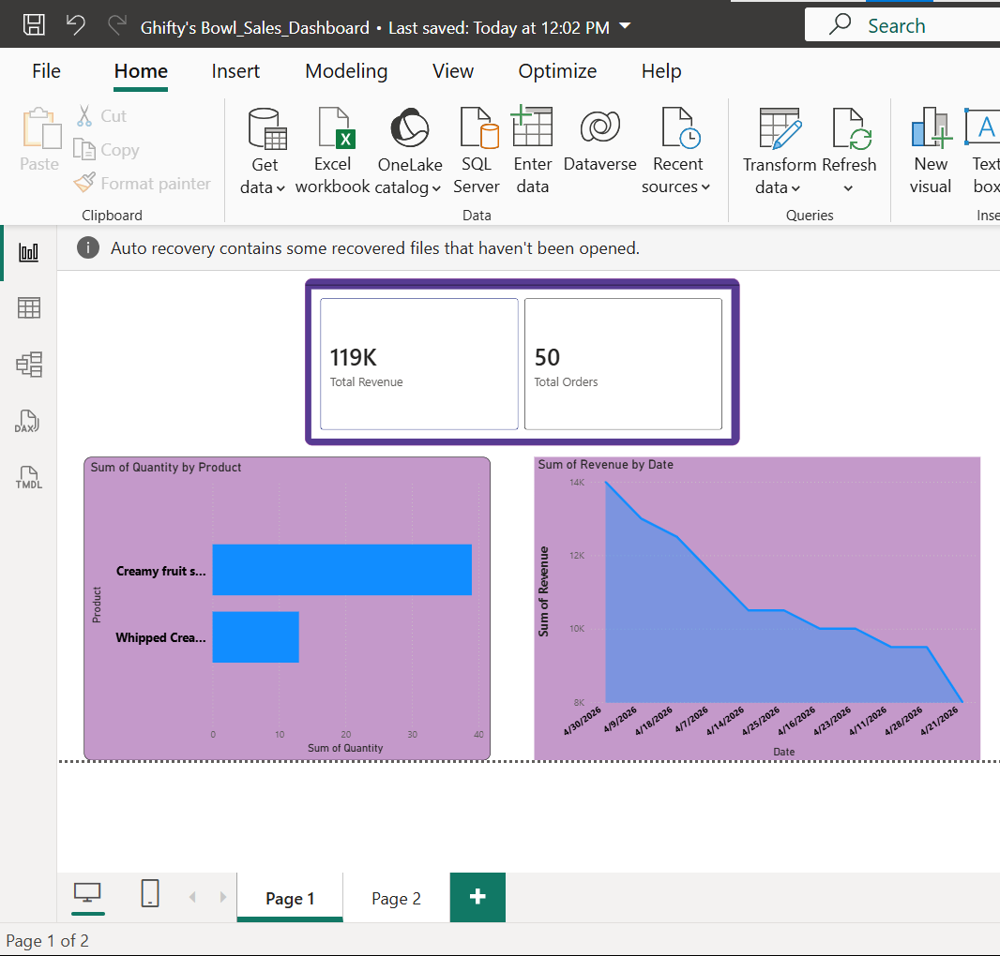
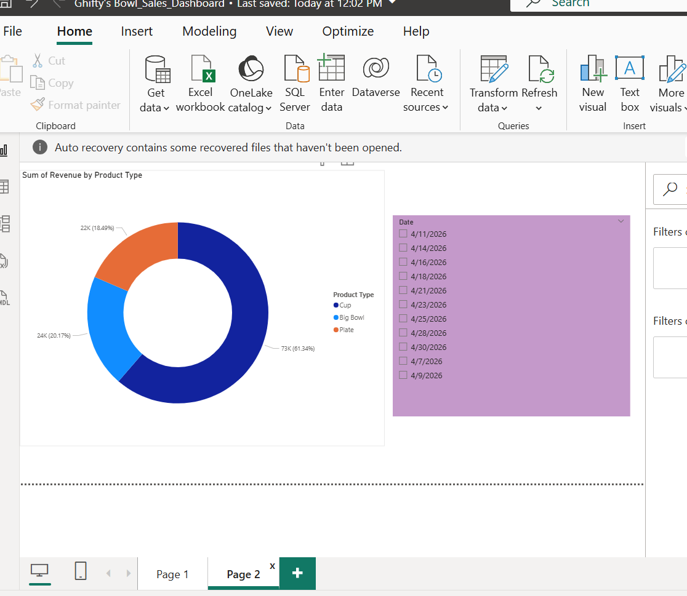

# Ghifty's Bowl Sales Dashboard

## Project Overview
This project analyzes sales performance data for my fruit salad business, Ghifty's Bowl. The analysis was carried out to understand revenue performance, customer orders, and top-selling products.

## Objectives
- Calculate total revenue generated
- Determine the total number of orders
- Identify the highest-selling product type
- Analyze sales performance trends

## Tools Used
- Microsoft Excel
- Power BI

## Dashboard Preview

## Key Insights
- Total revenue generated from sales was analyzed
- The total number of customer orders was calculated
- The highest-performing product category was identified
- Sales trends and performance metrics were visualized using Power BI

## Files Included
- Power BI Dashboard File (.pbix)
- Excel Dataset
- Dashboard Screenshot

## Project Purpose
This project was created to practice data analysis and dashboard visualization skills using real business data from my fruit salad business.

## Author
Mercy

